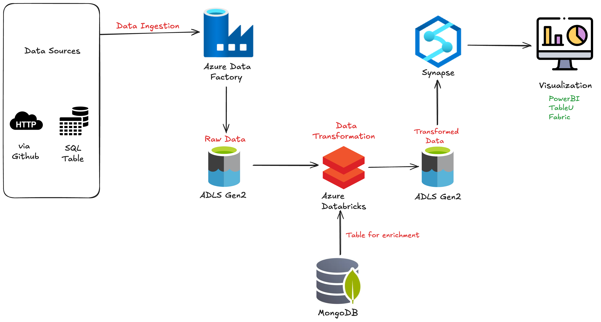

# 🛒 E-Commerce Data Engineering Project (Azure End-to-End Pipeline)

## 📌 Project Overview
This project demonstrates an end-to-end Data Engineering pipeline built using Microsoft Azure services including Azure Data Factory, Azure Data Lake Storage Gen2, Azure Databricks, Azure Synapse Analytics.
The pipeline ingests data from multiple sources, stores raw data in a data lake, performs transformations using Databricks, and loads analytics-ready data into Azure Synapse for reporting and visualization.

This project follows the **Medallion Architecture (Bronze, Silver, Gold)** approach for structured data processing.

---

# 🏗️ Architecture Diagram


---

# 🔄 Architecture Flow Explanation

## 1. Data Sources
Data is collected from multiple sources:
- HTTP / API Data (via GitHub)
- SQL Tables
- MongoDB (Used for data enrichment)

---

## 2. Data Ingestion – Azure Data Factory
Azure Data Factory is used to ingest data from source systems and load it into Azure Data Lake Storage Gen2 (Raw Layer).

---

## 3. Raw Data Storage – Azure Data Lake (Bronze Layer)
Raw data is stored in Azure Data Lake Storage Gen2 without transformations.

This layer contains:
- Raw CSV / JSON files
- Historical data
- Source system data

This is called the **Bronze Layer** in Medallion Architecture.

---

## 4. Data Transformation – Azure Databricks (Silver Layer)
Azure Databricks is used to:
- Clean data
- Remove duplicates
- Handle null values
- Standardize columns
- Join datasets
- Enrich data using MongoDB lookup tables
- Create transformed datasets

The cleaned and transformed data is stored again in Azure Data Lake.

This is called the **Silver Layer**.

---

## 5. Curated Data – Azure Synapse (Gold Layer)
The transformed data is loaded into Azure Synapse Analytics where:

- Curated Data is created and optimized for analytics queries

This is called the **Gold Layer** where data becomes business-ready.

---

# 🧱 Medallion Architecture (Bronze, Silver, Gold)
This project follows Medallion Architecture where data is refined across layers:
- **Bronze Layer** → Raw Data
- **Silver Layer** → Cleaned & Transformed Data
- **Gold Layer** → Analytics Ready Data

This architecture improves data quality and organizes data processing into structured layers. 

---

# ⚙️ Tech Stack
| Category | Tools |
|---------|------|
| Cloud Platform | Microsoft Azure |
| Data Ingestion | Azure Data Factory |
| Storage | Azure Data Lake Storage Gen2 |
| Processing | Azure Databricks (PySpark) |
| Data Warehouse | Azure Synapse Analytics |
| Database | MongoDB |
| Language | Python / PySpark / SQL |
| Version Control | GitHub |

---

# 📂 Project Structure
```
ecomm-de-project
│
├── adf/
├── databricks/
├── synapse/
├── data/
│ ├── bronze/
│ ├── silver/
│ ├── gold/
│
├── Screenshots/
│ └── architecture.png
│
└── README.md
```


---

# 🚀 Pipeline Workflow Summary
1. Data is collected from APIs and SQL tables
2. Azure Data Factory loads data into Azure Data Lake (Bronze)
3. Azure Databricks transforms and enriches data (Silver)
4. Transformed data stored back in Data Lake
5. Data loaded into Azure Synapse (Gold)

---

# 📊 Business Use Cases
This pipeline can be used for:
- Sales Analysis
- Customer Analytics
- Product Performance
- Revenue Dashboard
- Order Trends
- Seller Performance
- Payment Analysis

---

# 🧠 Data Engineering Concepts Used
- ETL / ELT Pipelines
- Azure Data Factory Pipelines
- Azure Databricks (PySpark)
- Medallion Architecture
- Star Schema Data Modeling
- Data Warehousing
- Workflow Orchestration
- Data Enrichment from MongoDB
- Cloud Data Engineering

---

# 📈 Future Improvements
- Implement Incremental Loading
- Add Data Quality Checks
- CI/CD for Data Pipelines
- Monitoring and Logging
- Power BI Dashboard Integration
- Data Catalog / Lineage

---

# 📸 Project Screenshots

## Azure Data Factory Pipeline


## Azure Data Lake Storage


## Azure Databricks Notebook (Silver Layer Data Transformation)
.png>)

## Azure Synapse (Gold Layer Data Preparation)
.png>)
.png>)

## Others


# 👨‍💻 Author
**Ridesh Raj**  
Data & Analytics Engineer

GitHub: https://github.com/rideshr
